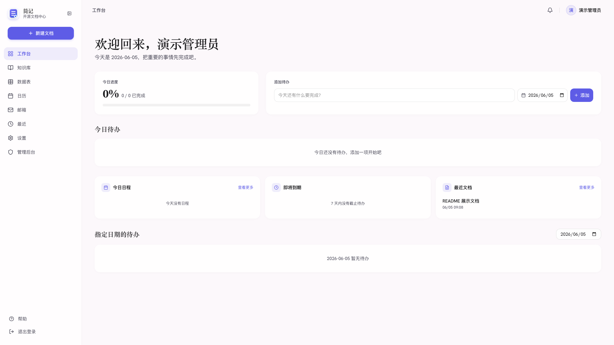
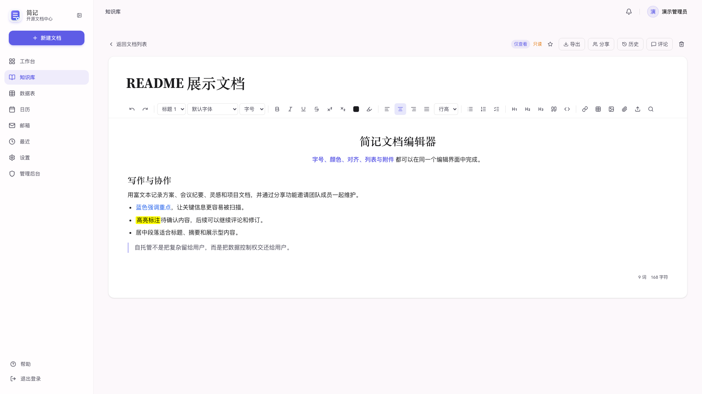
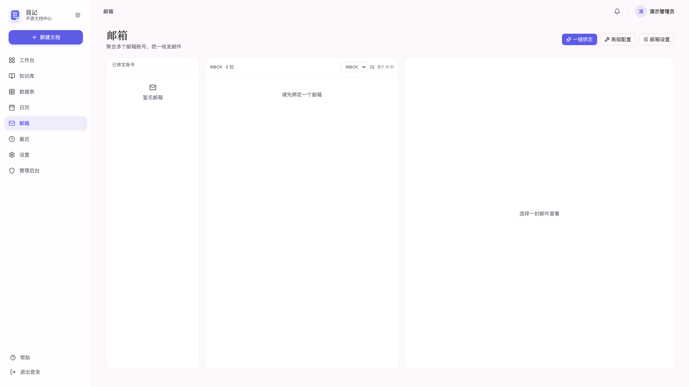
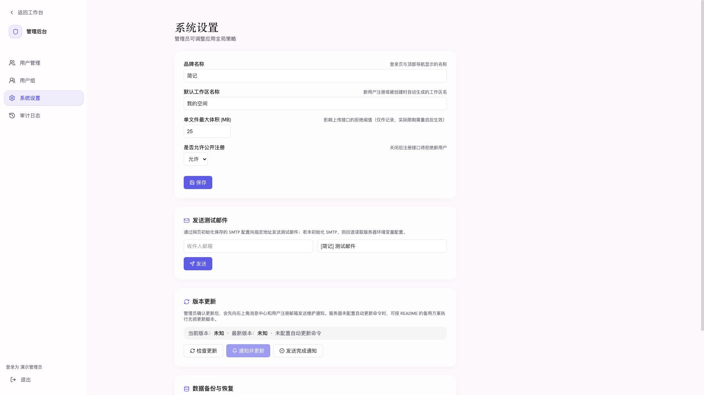

# 简记 Jianji

<p align="center">
  
</p>

<p align="center">
  一个轻量、自托管、多设备可用的开源知识工作台。
</p>

<p align="center">
  <a href="README.md">简体中文</a>
  ·
  <a href="README.en.md">English</a>
</p>

<p align="center">
  <a href="https://github.com/staklab/jianji/releases"></a>
  
  
  
  
  
</p>

简记把文档、数据表、日历、邮箱聚合、通知、分享协作和管理后台放在一个自托管空间里。它适合个人服务器、家庭服务器、小团队，以及所有希望把数据掌握在自己手里的用户。

## 预览

<table>
  <tr>
    <td></td>
    <td></td>
  </tr>
  <tr>
    <td align="center">工作台</td>
    <td align="center">文档编辑器</td>
  </tr>
  <tr>
    <td></td>
    <td></td>
  </tr>
  <tr>
    <td align="center">邮箱聚合</td>
    <td align="center">管理后台</td>
  </tr>
</table>

## 功能亮点

| 模块 | 能力 |
| --- | --- |
| 文档中心 | 私人/公共/共享/收藏视图，树形与网格布局，TipTap 富文本，附件上传，导出，评论，版本恢复 |
| 数据表 | 字段管理，模板，表格/看板/日历/甘特视图，公式字段，CSV/XLSX 导入导出，公开表单 |
| 日历 | 月/周/日视图，重复日程，待办拖入日历，站内与邮件提醒 |
| 邮箱聚合 | IMAP/SMTP 绑定，多文件夹同步，站内写信，附件发送，邮件转待办 |
| 用户与安全 | 注册邮箱验证码，找回密码，换绑邮箱，登录设备留痕，远程注销，管理员禁用用户 |
| 个性化 | 深色模式，主题色调色盘，默认首页，编辑器字号，邮箱同步偏好，字体管理 |
| 管理后台 | 用户、用户组、系统设置、SMTP 测试邮件、备份恢复、审计日志、版本更新 |
| 自托管部署 | 单容器 Docker Compose，SQLite 数据卷，同源 `/api`，一键部署，无损更新，完整迁移包 |

## 快速部署

推荐在服务器上使用 Docker Compose。安装脚本会生成 `.env`、强随机 `JWT_SECRET`、私密首次配置链接，并启动容器。管理员账号、SMTP、注册策略等内容会在浏览器初始化向导中配置。

```bash
curl -fsSL https://raw.githubusercontent.com/staklab/jianji/main/scripts/install.sh | bash -s -- \
  --app-url https://jianji.example.com \
  --yes
```

也可以先克隆仓库：

```bash
git clone https://github.com/staklab/jianji.git
cd jianji
bash scripts/install.sh
```

安装完成后查看状态和首次配置链接：

```bash
docker compose ps
docker compose logs -f jianji
cat ./SETUP_URL.txt
```

更多环境变量、SMTP、Nginx、证书和迁移说明见 [配置说明.md](配置说明.md)。

## 更新模型

简记不依赖 GitHub Releases 才能更新。默认情况下，后台版本面板读取 GitHub `main` 分支最新 commit；部署实例会把当前 commit 写入 `.env`，因此后续只要推送到 `main`，实例就能检测到新提交。

服务器无损更新：

```bash
bash scripts/update.sh
```

低内存服务器可使用宿主机构建、运行时镜像方式：

```bash
bash scripts/update-runtime.sh
```

更新脚本会备份 `.env` 和 `SETUP_URL.txt`，保留 SQLite 与上传文件 Docker 卷，拉取最新代码，重建容器，并等待服务健康检查通过。若部署目录不是 Git checkout，脚本会从 `JIANJI_UPDATE_REPO` / `JIANJI_UPDATE_BRANCH` 指向的 GitHub 分支归档刷新源码，同时继续保护运行时配置与数据。单容器部署会有极短重启窗口；如果需要严格零中断，可以在 Nginx 前做蓝绿发布。

如果你的部署环境无法稳定访问 GitHub 的仓库接口或源码归档地址，服务器端自动拉取更新将不可用。可以在一台能获取最新源码的本地电脑上执行推送式更新：

```bash
git pull
bash scripts/push-update.sh --host root@example.com --dir /opt/jianji --runtime
```

推送式更新会通过 SSH/rsync 同步源码，并让服务器跳过远端拉取步骤，直接执行无损重建；服务器上的 `.env`、初始化链接、证书、数据库、上传文件和备份目录不会被覆盖。

## 本地开发

```bash
npm run setup
npm run dev
```

默认开发地址：

| 服务 | 地址 |
| --- | --- |
| Web | `http://localhost:3000` |
| API | `http://localhost:4000` |

## 测试与构建

```bash
npm run lint
npm run test
npm run build
```

## 数据与安全

Docker 部署使用两个持久化卷：

| 卷 | 内容 |
| --- | --- |
| `jianji-data` | SQLite 数据库，挂载到 `/app/data` |
| `jianji-uploads` | 头像、附件等上传文件，挂载到 `/app/uploads` |

仓库和 Docker 构建上下文默认排除 `.env`、`SETUP_URL.txt`、SQLite 数据库、上传目录、证书、密钥和本地缓存。迁移包可能包含加密后的邮箱凭据和用户上传文件，请按私密备份保存。

## License

简记应用代码基于 [MIT License](LICENSE) 开源。内置字体遵循各自 OFL 许可，见 [LICENSES/FONTS.md](LICENSES/FONTS.md)。
